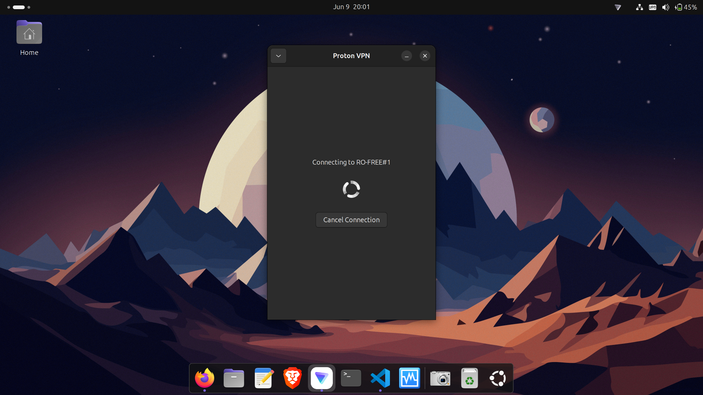
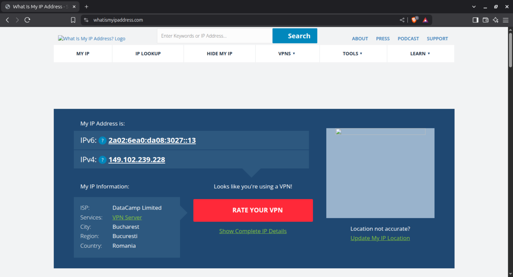
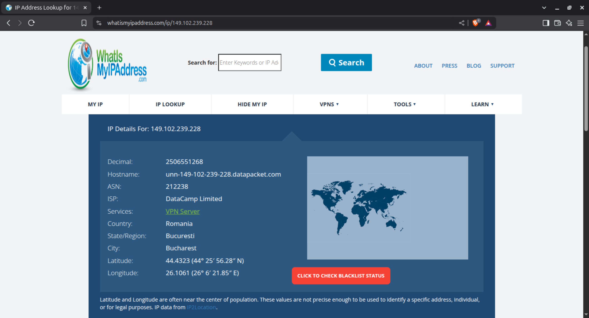
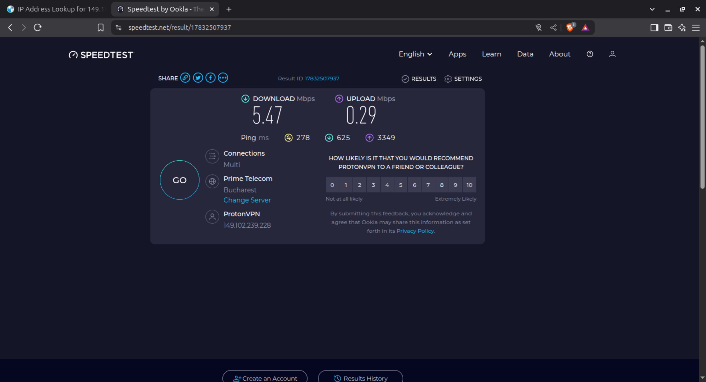

# 🛡️ Task 6: VPN Setup & Analysis

## 🔍 Objective

Understand the role of **VPNs** in protecting privacy and securing communication over the internet.

---

## 🔧 Tools Used

- [ProtonVPN (Free Tier)](https://protonvpn.com/)
- [whatismyipaddress.com](https://whatismyipaddress.com/)
- Web browser (Brave)
- `traceroute` command-line tool

---

## 🧰 Setup Steps

### 1. Sign Up for ProtonVPN

- Go to [https://protonvpn.com](https://protonvpn.com) and sign up for a free account or paid account based on your needs.

### 2. Download & Install ProtonVPN

- Download the client for your OS (Linux, Windows, macOS).

- On Linux (Debian-based):

    sudo apt update

    wget https://repo.protonvpn.com/debian/dists/stable/main/binary-all/protonvpn-stable-release_1.0.8_all.deb

    sudo dpkg -i ./protonvpn-stable-release_1.0.8_all.deb && sudo apt update

    sudo apt install proton-vpn-gnome-desktop

- On Linux to install linux system tray icon (optional)

    sudo apt install libayatana-appindicator3-1 gir1.2-ayatanaappindicator3-0.1 gnome-shell-extension-appindicator

### 3. Connect to a VPN Server

- Open the ProtonVPN client.

- Log in with your Proton account.

- Choose a free server if free version on paid you can choose which servers you want (e.g., Netherlands, US, Japan) and connect.

### 4. Verify VPN Connection

- Visit https://whatismyipaddress.com

- Note your new IP address and VPN location.

### 5. Test Encrypted Browsing

- Open any secure site like https://duckduckgo.com or https://proton.me

- Confirm browsing works as expected.

### 6. Disconnect VPN

- Disconnect from the VPN and compare browsing speed.

- Revisit whatismyipaddress.com to see your real IP.

---

## 📡 Traceroute Analysis

- Traceroute output (while connected to VPN) showing packet flow to 8.8.8.8:

    test@host:~$ traceroute 8.8.8.8
    traceroute to 8.8.8.8 (8.8.8.8), 30 hops max, 60 byte packets
    1  10.2.0.1 (10.2.0.1)  297.273 ms  311.609 ms  331.219 ms
    2  unn-212-102-51-125.cdn77.com (212.102.51.125)  336.998 ms  351.306 ms  376.667 ms
    3  vl205.tyo-eq8-core-1.cdn77.com (169.150.194.140)  411.342 ms  434.393 ms vl207.tyo-eq8-core-1.cdn77.com (169.150.194.142)  451.183 ms
    4  google-tyo.cdn77.com (79.127.193.189)  471.446 ms google-tyo.cdn77.com (79.127.193.191)  510.600 ms  514.557 ms
    5  192.178.248.179 (192.178.248.179)  550.456 ms 108.170.248.253 (108.170.248.253)  574.368 ms 108.170.231.103 (108.170.231.103)  590.381 ms
    6  142.250.226.9 (142.250.226.9)  611.438 ms 142.250.226.7 (142.250.226.7)  287.012 ms 142.251.251.3 (142.251.251.3)  286.243 ms
    7  dns.google (8.8.8.8)  298.837 ms  325.083 ms  340.086 ms

- The traceroute shows the VPN tunnel routing traffic through different intermediate nodes, including CDN providers and eventually to Google's DNS.

---

## 📸 Screenshots

- Proton VPN Interface

- Connection Starting

- Whatismyip Results

- Speedtest

---

## 📌 Conclusion

- Using ProtonVPN provided firsthand experience with secure, encrypted internet usage. The task demonstrated how VPNs protect identity and privacy online. The public IP was successfully masked, and all traffic was routed securely through Proton's servers.

---